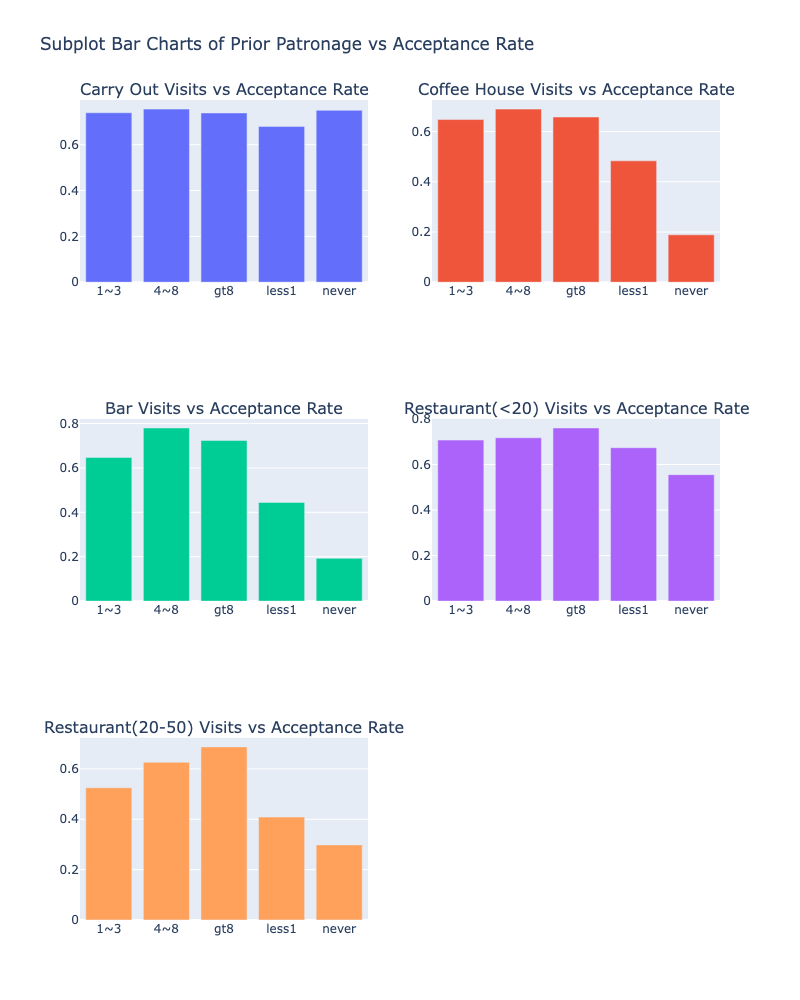
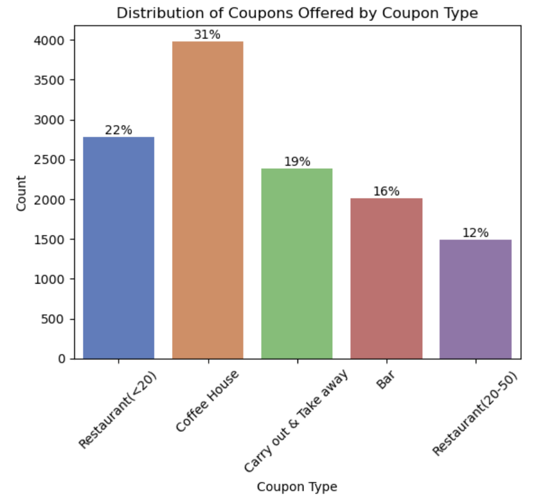
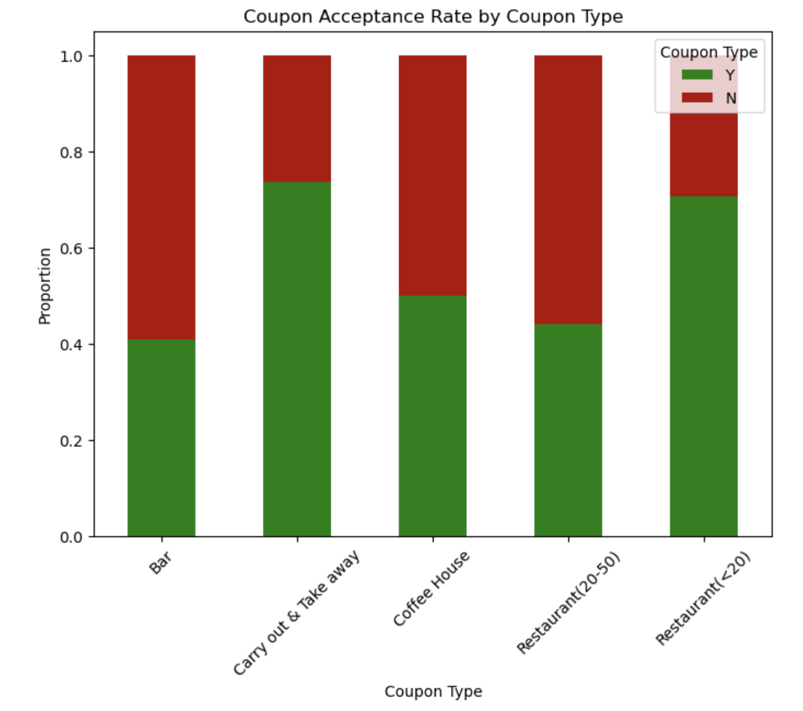

# UCB_AI-ML_5.1_coupons

This repository contains:
- **prompt_Fant.ipynb**: Jupyter Notebook with analysis and plots.
- **data/**: Folder with data files used in the notebook.
- **images/**: Folder with plots generated from the notebook.

### Project Description: 
The goal of this project was to use what I know about visualizations and probability distributions to distinguish between customers who accepted a driving coupon versus those that did not. This is a brief report that highlights the differences between customers who did and did not accept the coupons.

### Problem
Of all the participants, the total coupon acceptance rate was 57%.  

After some initial exploratory data analysis (EDA), I made the following hypotheses to guide my analysis.  My hope was to identify areas of opportunity to increase the programs success (as measured by coupon acceptance) through my understanding of what influenced a customer's probability of accepting an offered coupon.

#### Hypotheses:

**Primary Hypothesis:**
Customer coupon acceptance rates are strongly influenced by prior patronage habits specific to the type of establishment (e.g., bar, coffee house, or upscale restaurant). Customers with a higher historical frequency of visiting such establishments are more likely to accept corresponding coupons.

**Supporting Hypotheses:**

Coupon Expiration Dynamics:

Coupons with a shorter expiration period (e.g., 2 hours) may lead to higher immediate usage, while longer expiration periods (e.g., 1 day) may encourage acceptance for future use. Since success for our usecase includes acceptance for later usage, offering the longer expiration in all cases may help boost acceptance rates.  We might also be open to testing longer experation periods.

Contextual Influence:

Contextual influence such as passangers, direction of travel, and weather may have varying influence on acceptance especially if coupons do not have to be redeemed right away.  However,coupons offered during certain times of day (e.g., morning while heading to work) are less likely to be accepted due to conflicting priorities/mindspace. 

### Findings
With regard to my **primary hypothesis**, this was only mostly right. While correlated for many of the coupon categories, for the most accepted coupon types (Carry Out and Cheap Restaurants (<20)), something else seems to be driving the overall higher acceptance rate.

In order to identify where acceptance rates have a disproportionate impact to overall rates, I looked at the distribution of offers by coupon type as well as the acceptance rates.  I found 'Carry Away', followed by 'Cheap Restaurants' coupon acceptance rates were above average.  Additionally, 'Coffee House' coupons had the highest proportion of offers.  

Common Findings:
With regard to my supporting hypotheses, I found that for all three coupon types I analyzed, expirations of 1 day had a much higher acceptance rate.  Moving all expirations to 1 day should increase acceptance rates as hypothesized. 

Additionally, for all three coupon types, drivers with passangers who were friends or partners had a higher tendency to accept the coupons.  Though the correlation for 'Carry Out' coupons was not as signficant as the other two. 

Lastly, 2pm seems to be a peak for all coupons analyzed.  If there are resource limitations and I had to pick one time across the board to blast offers, I recommend focusing on sending at 2pm.  

Specific Coupon Group Findings:

CARRY OUT:
Generally speaking, people who were offered 'Carry Out' coupons had a high propensity to accept.  It would seem that the primary factor here is the type of establishment itself.  Carry Out establishments are very condusive for picking up while out driving so I would hypothesize this to be The main factor for high acceptance rates.  
   

COFFEE HOUSE:
Drivers below the age of 21 had a much higher propensity to accept Coffee House coupons. For other coupons, age was less likely to ve a factor. Unlike the other two coupon types, weather was not a factor for this coupon type.  A destination of No Urgent Place, had a higher propensity for coupon acceptance. 

CHEAP RESTAURANT:
Sunny weather was much more likely when drivers accepted Cheap Restaurant coupons.  Additionally, this group was more likey to accept if they were not urgently trying to get to work or home.  

